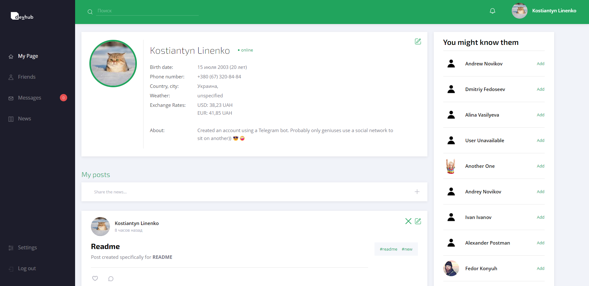
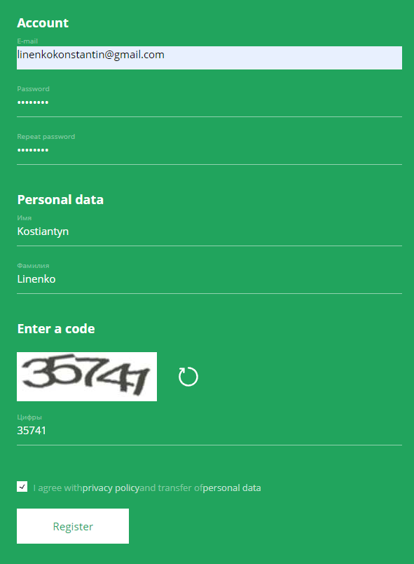
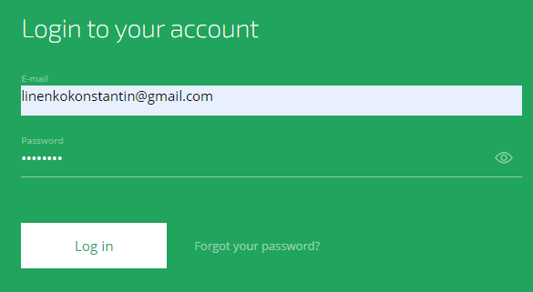
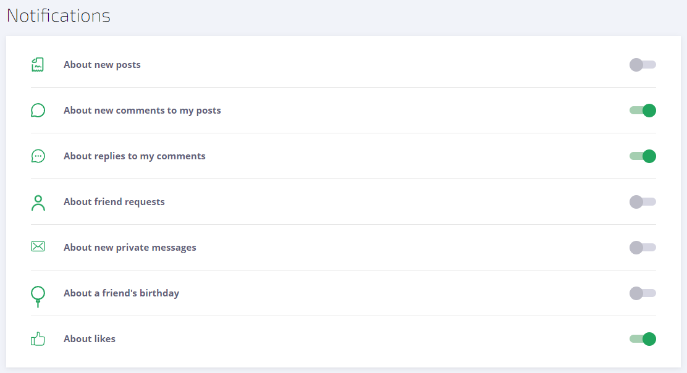
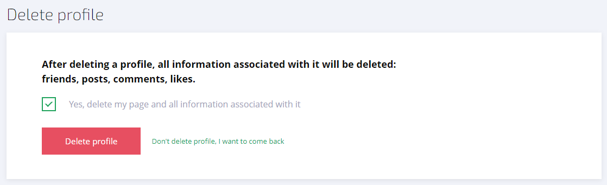
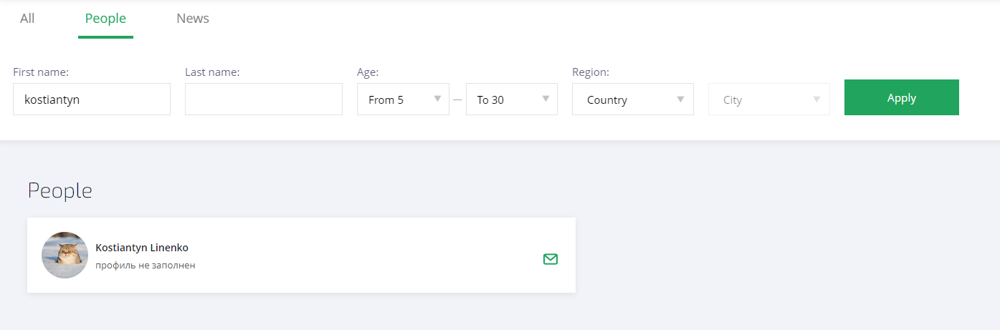
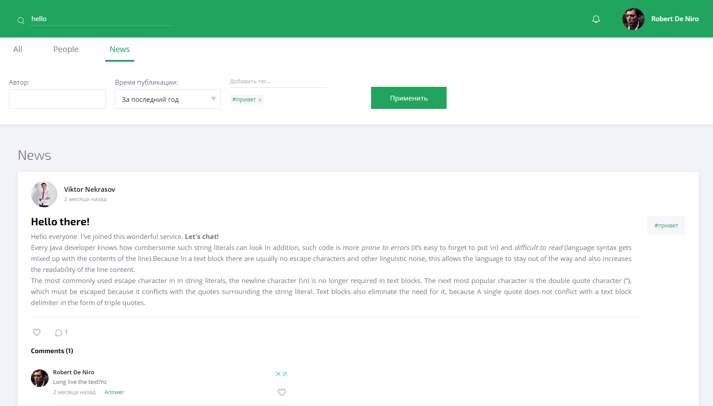
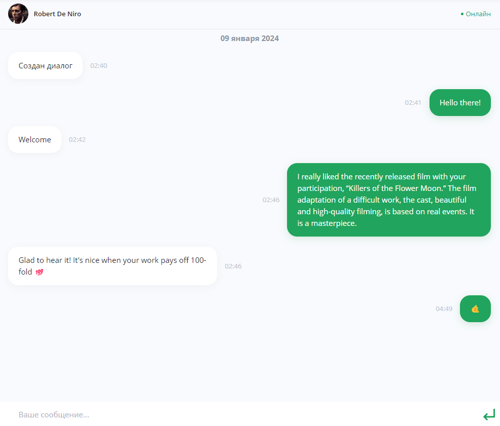
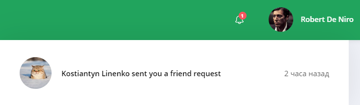

<h1 align="center">DevHub Social Network</h1>

---

## Description

**DevHub** :iphone: is a place where you can develop and feel as comfortable as possible in the circle of nice people. 
This is a community of professionals united by one idea - `with the help of code, magic will become reality`!
The project provides an opportunity for users to freely express their thoughts, show their creativity by creating posts 
and commenting on other people's posts. Everyone will be able to find like-minded people and communicate on topics 
that interest them, regardless of location, all over the world! :sunglasses:

---

## Functionality
### 1. Registration/authorization

+ To **register** , a new user must enter his email, password, first and last name, and also confirm the captcha :ballot_box_with_check:.

+ To **log in**, the user enters his email and password.

### 2. News feed
+ On your personal page you can view your posts with the ability to edit and delete them, as well as create a new post.

+ In the **News** tab you can view the most current news and interact with them.

### 3. Working with profile and images
The project provides a number of opportunities for working with a personal profile:
+ **Entering and editing personal data**.

+ **Setting up notifications**.

+ **Change and restore password**.
  The user can either change the password or recover it. A letter with the necessary instructions will be sent to your current email address.

+ **Account deletion**.
  Before deleting his profile, the user must confirm his action or refuse.

### 4. Search for users and posts by all comments
There is a global search :mag: in which you can search for other users or posts using certain criteria.

+ Users can be searched for:
  + *First* and *last name*
  + *Age*
  + *Region* or *city*

+ Posts can be searched by:
  + *Author*
  + *Time of publication*
  + *Tags*

### 5. Friends and recommendations
Interaction with other users has been implemented, in particular you can:

+ Add people as friends and cancel outgoing requests
+ Accept and reject incoming requests
+ Block and unblock users
+ View recommendations - people we may know `(special algorithms are used to select candidates)`

### 6. Communication and notifications

+ Everyone has the opportunity to communicate with other users only if you have not annoyed them and they have not blocked you :trollface:.

> [!NOTE]
> The chat implementation is written using **WebSocket**, so you can communicate in real time, as expected.

+ In accordance with the settings, the user can receive various types of notifications:
  + New posts
  + Comments and likes on posts
  + Replies to your comments
  + Friend requests
  + Messages
  + Friends birthdays

### 7. Admin panel
This component of the project is implemented in a separate application. Its goal is consistent with the name - administration of a social network.
Here you can:
+ View site statistics: likes, posts, registered users, etc.
+ Manage user accounts

> You can view the application [here](https://github.com/KonstantinLi/socialnet_admin)

### 8. Telegram bot
[Telegram bot](https://github.com/KonstantinLi/socialnet_bot) provides an alternative and, most importantly, convenient interface,
which implemented exactly the same functionality as a standard frontend application. The main advantage of a telegram bot
is that the user will be able to easily access the API using his mobile phone, wherever he is.